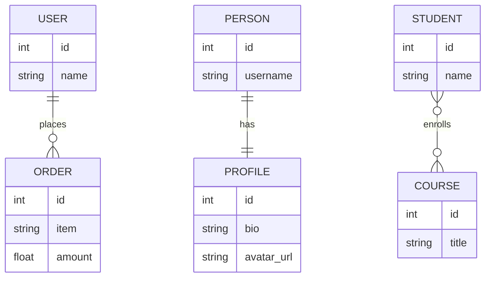

# JPA  and Database Mappings

# Relational Database
.....

# Database Relationships *refresher*
- One to One - Both tables have only one record on each side of teh relations ship
  - Like an extension of the data row
- One to Many - The primary table has one record that relates to zero or many records in the related table
  - An object with a list property
- Many to Many - Each record in both tables may be related to zero or many records in the related table
  - Two lists, related to each other.

# Database Constraints
- Best practice is to use database constraints to enforce relationships
- One to one - Both tables can share the primary key value or one table can have its own primary key and unique key on id column of related tables.
- One to many - The related tables has columns for primary key of primary table with foreign key constraint.
- Many to Many - Join table is used with composite primary key consisting of the primary key values of related tables with foreign key constraints.

# Relationship Direction
- Bi-Directional - Relationship can be accessed from either side of the relationship
- Uni-Directional - Relationship can be accessed from either side of the relationship

# Cascade Operations
- Hibernate has the ability to Cascade persistence operations
- *Needs be used with caution*

# Foreign Key Declaration
- JPA does have a @ForeignKey annotation
- This is meta-data information only
- Hibernate will reference this for schema generation only
- It is not enforced nor generated if missing
- When using schema migration tools like Liquibase or Flyway it is not needed

# Hibernate Cascade types
- ALL - propagates all operations
- PERSIST - Will also save child objects (transient instances)
- MERGE - Merge copies the state of a given object to the persistent object. MERGE includes child entities
- REMOTE - Cascades delete operations to child objects
- DETACH - Detaches child objects persistence context
- DELETE - Save as JPA REMOVE
- SAVE_UPDATE - Cascades Hibernate Save and Update operations to child objects
- REPLICATE - Replicates child objects to second data source
- LOCK - Reattaches entity and children to persistence context - without refresh