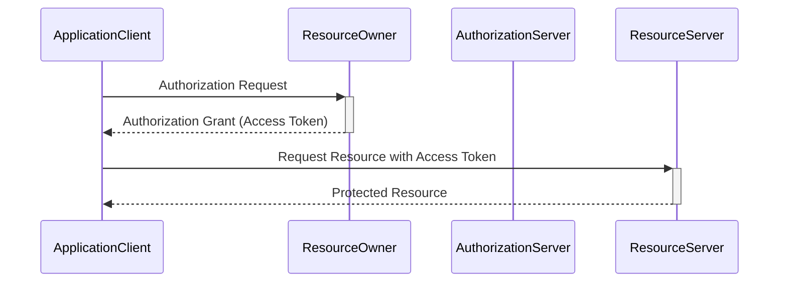

# Overview of OAuth 2 and JWT Tokens

## Overview of OAuth 2
- OAuth 2 is an authorisation framework
- OAuth 2 is used to grant limited access to resources without full access to the account
- Used by experienced organisations
  - "Sign in with" - is using OAuth 2
  - Allows you to grant access to a third party resource to act on your behalf

## OAuth Roles
- Resource Owner - the user who wishes to grant an application (client) access
- Client - The application requesting access
- Resource Server - The resource to access
- Authorisation Server - Verifies the identity of the user then issues access tokens to the application

## Abstract Protocol Flow - GPT generated take with 🧂

## Types of OAuth Authorisation Flows
- Authorisation Code Flow - Server Side web applications where source code is not exposed publicly
- Client Credentials Flow - Used by services, where the "user" is a server role
- Resource Owner Password Flow - Used by highly trusted applications when redirects cannot be used
- Implicit Flow - User grants access with redirects
- Hybrid Flow - similar to Client Credentials, but for long running applications.

## Types of OAuth Authorisation Flows (Cont)
- Device Authorisation Flow - Used by input constrained devices
- Authorisation Code Flow with PKCE - Flow using proof Key Exchange

## JWT Tokens
- JWT - JSON Web Token - often pronounced J-oot
- RFC 7519 - IETF Specification for JWT, defines how JWT is structured
- HTTP / REST are stateless - each request is self contained
  - Unlike Web Applications which often use session id's store in cookies
- JWT token has user information and authorised roles (scopes)
- JWT has three parts - Header, Payload(data) and *Signature*
- The 3 parts are tokenized using Base 64 encoding

## JWT Token Signing
- JWT's are signed - which prevents clients from altering the contents of the JWT token
- JWT's maybe signed using a number of techniques
- Symmetric encryption - .........Used single key to sign, requires key to be shared
- Asymmetric encryption - Uses public and private key (aka key pair)
  - Private Key is used to generate signature and is not shared
  - Public Key is shared and is used to verify signature

## JWT Token Verification
- The Authorisation server signs the JWT token using the private key
- The Resource Server requests the public key from the Authorisation Server
- Using the public key the resource server verifies the signature of the JWT token
- The resource server can cache the public key for verification for future requests
  - Once the resource server has the public key, JWT tokens can be validated without additional requests from the Authorisation Server

## OAuth vs HTTP Basic
- HTTP Basic Authentication requires user credentials to be shared with every resource
- HTTP Basic Authentication sends user credentials unencrypted in HTTP Header and can be compromised
- With OAuth user credentials are only share with Authentication Server
- User credentials cannot be obtained from authorisation token
- HTTP Basic Authentication has no concept of security roles
- With OAuth 2 security roles are defined in scopes and pass in token

# **See Spring Docs**