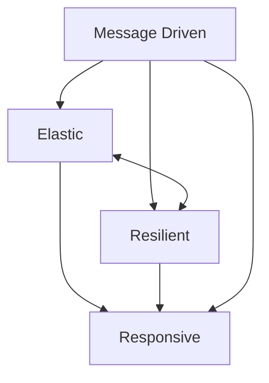

# The Reactive Manifesto

Available on internet at www.reactivemanifesto.org
*Caution around bad use of terminology*

## Reactive Manifesto - Responsive
- The system responds in a timely manner
- Responsiveness is the cornerstone of usability and utility.
- Responsiveness also means problems may be detected quickly and dealt with effectively
- Responsive Systems provide rapid and consistent response times
- Consistent behaviour simplifies error handling, builds user end confidence and encourages further interaction

## Reactive Manifesto - Resilient
- System stays responsive in the face of failure
- Resilience is achieved by replication, containment, isolation and delegation.
- Failures are contained within each component
- Parts of the system can fail, without compromising the system as a whole.
- Recover of each component is delegated to another
- High-availability is ensured by replication where necessary 

## Reactive Manifesto - Elastic
- They system stays responsive under varying workload
- Reactive Systems can react to changes in the input rate by increasing or decreasing resources allocated to service inputs
- Reactive systems achieve elasticity in a cost-effective way on commodity hardware and software platforms (cloud)

## Reactive Manifesto - Message Driven
- Reactive Systems rely on asynchronous message passing to establish a boundary between components
- This ensures lose coupling, isolation and location transparency
- Message passing enables load management, elasticity and flow control.
- Location transparent messaging makes management of failures possible.
- Non-blocking communication allows recipient to only consume resources while active, leading to less system overhead.

# Reactive Programming
- Useful implementation technique
- Focuses on non-blocking, asynchronous execution - a key characteristic of Reactive Systems
- Reactive programming is just one tool in building reactive systems
  - Reactive programming is more granular at the program level

# Reactive Programming Performance
- Reactive *does not* equal fast
- Typical CRUD type application will not see much, if any performance improvement
- Reactive can improve computing efficiency
  - Best used for streaming type applications
- The immutable nature of Reactive applications can help with application quality *Scala 🤔*

# Reactive Programming
- Reactive Programming is an asynchronous programming paradigm focused on streams of data.
- "Reactive programs also maintain a continuous interaction with their environment, but at a speed which is determined by the environment, not the program itself. Interactive programs work at their own pace and mostly deal with communication, while reactive programs only work in response to external demands and mostly deal with accurate interrupt handling. Real-time programs are usually reactive" - Source: Gerad Berry

## Common Use Cases
- External Service Calls
- Highly Concurrent Message Consumers
- Spreadsheets
- Abstraction Over Asynchronous Processing
- Abstract whether your program is synchronous or asynchronous

## Features of Reactive Programming
- Data Streams
- Asynchronous
- Non-blocking
- Backpressure
- Failures as Messages

## Asynchronous
- Events are captured asynchronously
- A function is defined to execute when an event is emitted.
- Another function is defined if an error is emitted
- Another function is defined when complete is emitted

## Non-Blocking
- The concept of using non-blocking is important
- In Blocking, the code will stop and wait for more data (i.e reading from disk, network etc)
- Non-blocking in contrast will process available data, ask to be notified when more is available and then continue

## Backpressure
- Ability of the subscriber to throttle data

## Failures as Messages
- Exceptions are not thrown in a traditional sense
- Would break processing of stream
- Exceptions are processed by a handler function

## Summary
- Reactive Programming focuses on processing streams of data
- Traditional CRUD is still relevant
- Reactive doesn't equal fast
- Performance benefit is more apparent with a system under load (vs individual transactions)

# Reactive Streams API
- Goal is to create a standard for asynchronous stream processing with non-blocking back pressure
- Reactive Streams start with engineer in Netflix, Pivotal, Lightbend, Red Hat, Twitter and Oracle
- Reactive Streams is a set of 4 interfaces which define the API
- April 30th was release date of 1.0.0
- Under JEP-266 - Reactive Streams is now a part of Java 9 JDK
- Adoptions: Akka Streams, MongoDB, Ratpack, Reactive Rabbit, Project Reactor (Spring 5), RxJava, Slick 3.0, Vert.x 3.0, Cassandra, ElasticSearch, Kafka, Play
- 9th August 2017 version 1.0.1 of Reactive Streams was released

## Spring Reactive Types
- Two new reactive types are introduced with Spring Framework 5
  - Mono - is a publisher with zero or one elements in data stream
  - Flux - is a publisher with zero or many elements in the data stream.
    - Both Types implement the Reactive Streams Publisher interface