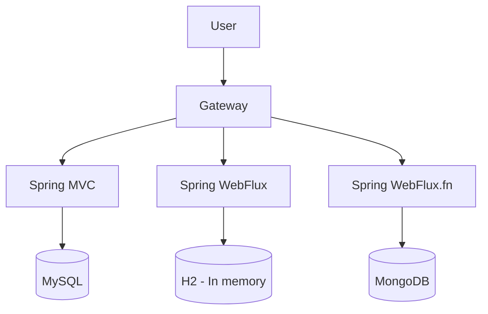

# Spring Cloud Gateway notes

# Spring Cloud Gateway - Overview
- Spring Cloud Gateway is an API Gateway
- An API Gateway provides a common access point to obscure running location of application
- Typically used with micro services to expose a common URL and abstract where the service is running.
- API gateways act as a proxy to direct traffic to and from running instances.
- Spring Cloud Gateway uses WebFlux
- Spring Cloud Gateway is part of a larger family of projects for Spring Cloud

### Instructions for running
- Set port via application.properties - server.port=1234
  - spring-6-restmvc, server port 8081 ‼ MySQL need to be running.
  - spring-6-auth-server, server port 9000
  - spring-6-reactive, server port 8082
  - spring-6-reactive-mongo, server port 8083 !! MongoDB needs to be running