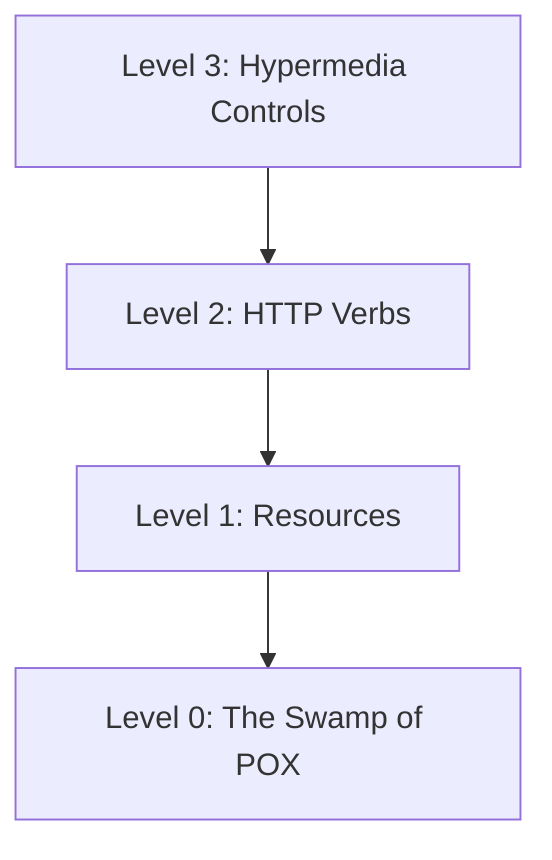

# Notes on REST

## Request Methods
- Post - used to post data to a server (like a checkout form)
- Put - a reqeust for the enclosed entity to be stored at the supplied URI. If the entity exists it is expected to be updated
- Post - A create request
- Put - A create OR update request
- Delete - Request to delete the specified resource
- Trace - Echo the received reqeust. Can be used to see if the reqeust was altered by intermediate servers
- Options - Returns the HTTP methods supported by the server for the specified URL
- Connect - Converts the reqeust to a transparent TCP/IP Tunnel, Typically for HTTPS through an unencrypted HTTP proxy
- Patch - Applies partial modifications to the specified resource

## Safe Methods
- Fetch info and nothing else: GET, HEAD, OPTIONS and TRACE
- Idempotent
  - PUT and DELETE
  - Safe verbs are also idempotent: GET, HEAD, TRACE, OPTIONS
  - *Idempotency is not enforced by the protocol*

## Non-Idempotent Methods
- POST is NOT Idempotent: Multiple Posts are will create multiple resources

[//]: # (TODO Insert Rest Table)

## HTTP Status Codes
- 100 series are informational in nature
- 200 series indicate successful request
- 300 series are redirections
- 400 series are client errors
- 500 series are server side errors

## Common HTTP Status Codes
- 200 Okay; 201 Created; 204 Accepted
- 301 Moved Permanently
- 400 Bad Reqeust; 401 Not Authorised; 404 Not Found
- 500 Internal Server Error; 503 Service Unavailable

## RESTful Web Services
- Popular
- REST - Representational State Transfer
  - Representation: JSON and XML
  - State Transfer - Typically via HTTP
    - Established by Roy Fielding from his 2000 doctoral dissertation
  - HTTP Status codes are used to communicate success, failure or errors
  - REST is not a formal standard, more generally agreed upon methods and techinques
    - Unlike SOAP

## RESTful Terminology
- Verbs - HTTP Methods: GET, PUT, POST, DELETE
- Messages - the payload of the action (JSON/XML)
- URI - Uniform Resource Identifier
  - A unique string identifying a resource
- URL - Uniform Resource Locator
  - A URI with network information
- Idempotence
  - "Apply certain operations multiple times without changing the result beyond the initial application"
  - In other words, you can exercise the operation multiple times, without changing the result
    - Example: Refreshing a web page (HTTP GET operation)
- Stateless - Service does not maintain any client state
- HATEOAS - Hypermedia As The Enginer of application State
  - Wikipedia - "a REST client should then be able to use a server-provided links dynamically to discover all the available actions and resources it needs. As access proceeds, the server responds with text that includes hyperlinks to other actions that are currently available"

## HTTP - GET
- Use: to read data from resource
- Read only
- Idempotent
- Safe operation - does not change state resource
- CRUD - Read

## HTTP - PUT
- Use: to insert (if not found) or update (if found)
- Idempotent - Multiple PUTs will not change result
  - Like saving a file multiple times
- Not Safe operations - does change state of resource
- CRUD - Created, Update

## HTTP - POST
- Use: to create new object (insert)
- Non-Idempotent - Multiple POSTs is expected to create multiple objects
- Not Safe operation - does change state of resource
- Only Non-Idempotent - does change state of resource
- CRUD - Create

## HTTP - PATCH
- Use: to partially update an existing resource
- Non-Idempotent - Multiple PATCH requests may change state
  - Typically, is Idempotent, but is not required to be
- Not Safe operation - does change state of resource
- CRUD - Update

## Richardson Maturity Model (RMM)
- A model to describe the maturity of RESTful services
- Unlike SOAD, there is no formal specification for REST
- RMM is used to describe the quality of the RESTful service

- Core Technologies: Hypermedia, HTTP, URI

## RMM Levels described
- Level 0
  - POX - Plain Old XML
  - Uses implementing protocol as a transport protocol
  - Typically, uses one URI and one kind of method
  - Examples - RPC, SOAP, XML-RPC

- Level 1: Resources
  - Uses Multiple URIs to identify specific resources
  - Still uses a single method (ie GET)

- Level 2: HTTP Verbs
  - HTTP Verbs are used URIs for desired actions
  - Examples:
    - .....meh if needed
    
- Level 3: Hypermedia
  - Representation not contains URIs which may be useful to consumers
  - Helps client developers explore the resource
  - No clear standard at this time
  - Spring provides an implementation of HATEAOS *self discovery APIs*

# Summary

- Level 1 - Breaks large service into district URIs
- Level 2 - Introduces Verbs to implement actions
- Level 3 - provides discoverability, making the API more self documenting

# Spring Framework and RESTful Services
- The Spring Framework has very robust support for creating and consuming RESTFul Web Services
- Spring Framework has 3 Distinct web frameworks for creating RESTful services
- Spring Framework has 2 Distinct web client for consuming RESTful services
*There are also several popular libraries for creating and consuming RESTful services frequently used with Spring*

# Spring MVC - Web Framework
- Spring MVC is the oldest and most commonly used library for creating RESTful web services
- Part of the core Spring Framework
- MVC - Model View Controller
- Has robust support for traditional Web Applications
- Based on traditional Java Servlet API
  - By nature this is blocking, non-reactive

# Spring WebFlux - Web Framework
- Uses project Reactor to provide reactive web services
  - Does not use Java Servlet API, thus non-blocking
- Follows very closely to the configuration model of Spring MVC
  - Provides an easy transition for developers accustomed to traditional Spring MVC

# WebFlux.fn - Web Framework
- WebFlux.fn is a functional programming model used to define endpoints
- Alternative to annotation based configuration
- Designed to rapidly and simply define microservice endpoints

# Spring RestTemplate - Web Client
- RestTemplate is Spring's primary library for consuming RESTFul web services
- Very mature - been a part of Spring for a very long time
- Highly configurable
- As of Spring Framework 5 RestTemplate is in maintenance mode
  - No new features are planned
  - Step before deprecation, Spring recommends using WebClient for new development

# Spring WebClient - Web Client
- Spring WebClient was introduced in Spring Framework version 5
- This is Spring's reactive web client
- By default, Reactor Netty, a non-blocking HTTP Client library

# Marshalling / Unmarshalling
- Converting Java POJOs to JSON or XMl is called Marshalling
- Converting JSON or XMl to Java Object is called Unmarshalling
- By default, Spring Boot configures Jackson to facilitate Marshalling and Unmarshalling
- Spring Boot does support several other libraries, Jackson is the most popular
- Jackson will be focus of the course

# SPA - Single Page Applications
- RESTful APIs are often combined with SPA applications for rich user web applications
- Popular client side SPA frameworks include Vue, BackBoneJS, ReactJS, AngularJS and EmberJS
- Frequent question is which framework is the "best" to use with Spring Boot
- The correct answer is that it does not matter
  - The framework used is decoupled from Spring via the HTTP / JSON (or XML) layer
  - All of these libraries can consumer RESTful APIs
  - Server side can be Spring Boot, .NET, Ruby on Rails, etc. - the RESTful API abstracts the implementation